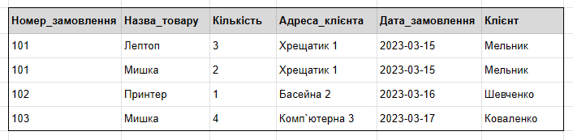
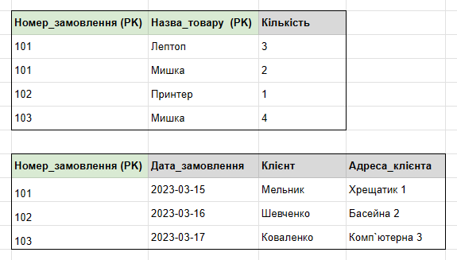
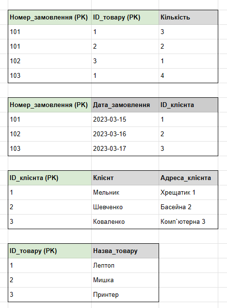
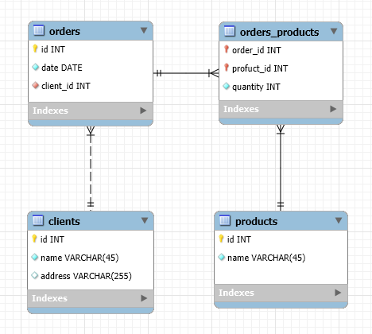
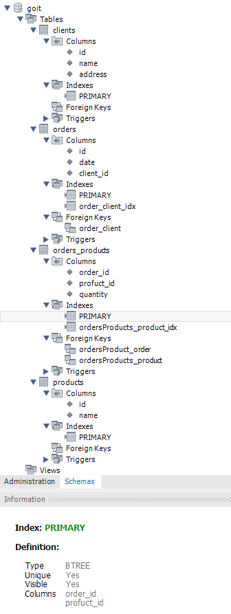

# Relational Databases Normalization HW-02

- [RDB_Normlization.xls](RDB_Normlization.xlsx) 
- [MySQL Workbench model](orders.mwb)

## Initial table

## 1NF

## 2NF

## 3NF

## ER Diaagram

## Database Schema

